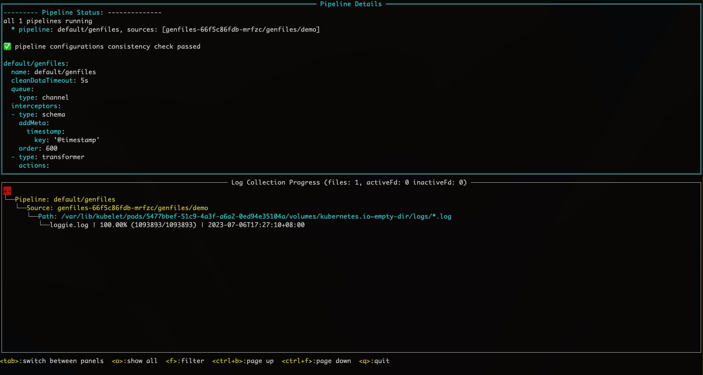
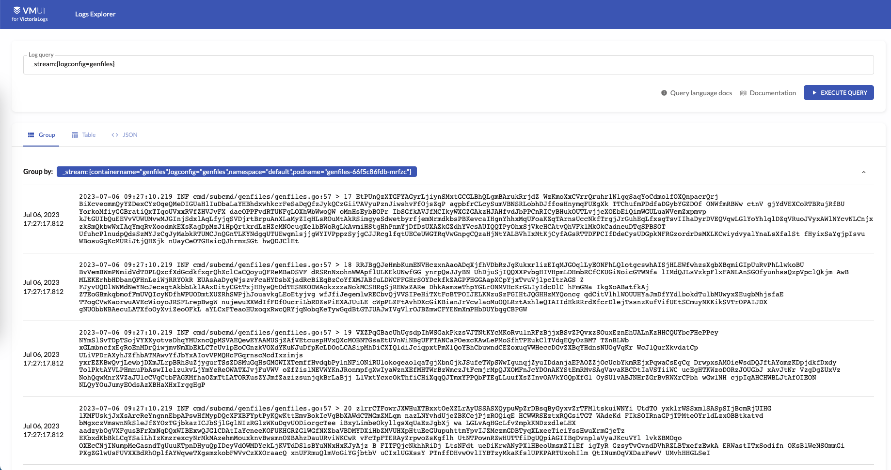

# 尝鲜初体验：使用Loggie和VictoriaLogs快速构建新一代的日志系统

如果你熟悉Prometheus，想必你肯定也知道VictoriaMetrics，这款越来越流行的监控项目，可作为Prometheus的增强或者平替。VictoriaMetrics一个重要的亮点就是解决Prometheus在大规模Metrics指标数据量级下的存储问题。

同属于可观测性，当我们把眼光聚焦到日志领域，其实很久以来日志的一个痛点是也是存储。

## 当前日志存储的痛点

时下比较常见的一些开源日志存储项目有：Elasticsearch、Clickhouse、Loki等。当然，Elasticsearch和Clickhouse并非天生针对日志存储而设计，我们只是可以拿来存储日志数据而已。

比如Elasticsearch的核心是一个搜索引擎。针对日志存储的场景，可以全文检索是一大优势，但同时存在以下一些不足：

- 写入性能相对慢
- 资源占用较高
- 针对日志存储的压缩差

总体来说，Elasticsearch是一款历史悠久、被广泛使用的日志存储数据库，毕竟当年ELK的概念深入人心。但是，在当前降本增效的大背景下，很多企业还是会对Elasticsearch占用的机器资源比较敏感，如果只用于存储大量的运维类日志，性价比还是偏低。

所以前两年Grafana家的Loki横空出世，还是掀起了一点水花的，毕竟日志领域早就苦Elasticsearch久矣。

简单介绍一下Loki的优点：

- 天生就是为了存储日志设计
- 资源占用还不错
- 引入了日志流Log Stream的概念

大半年前，我们公司内部有部门开始尝试使用Loki存储一些系统日志。但总会遇到一些小问题，并不是很让人放心。除此之外，Loki的不足之处还有：

- 没有实际意义上的全文检索，所以关键字查询等可能会比较慢
- 不支持独立设置检索的label，可能导致性能等一系列问题

当然，Loki还是一个相对年轻的项目，我们可以理解这些稳定性、性能、设计上的问题可能是发展早期的阵痛。

但是，貌似很多人已经等不及了。

## 姗姗来迟：VictoriaLogs的优势

最近VictoriaMetrics发布了预览版的VictoriaLogs，类似Loki专门用于存储日志。鉴于VictoriaMetrics的良好名声，还是让大家对这条搅局的「鲶鱼」充满了一定的期待。

VictoriaMetrics为什么要入局搞VictoriaLogs呢？

其实从2020年的这个Issues开始：https://github.com/VictoriaMetrics/VictoriaMetrics/issues/816

VictoriaMetrics就有了研发VictoriaLogs的想法。从该issues的讨论中我们可以看出，大家对Loki还是有点微辞的，比如说存储依赖S3（本地存储不支持分布式），比如说性能。

这里节选一下issues里的吐槽：

> almost 2 years passed and Loki is still unusable for scenarios with real logging data. Trying to query anything hitting more than 50k logs is exploding servers :)
> 

不用翻译了，隔着屏幕我们都能感受到这个用户的强烈不满。

时隔两年多，VictoriaLogs终于正式来到了我们面前，那VictoriaLogs到底有哪些优势，又能解决日志存储领域的哪些问题呢？

这里我简略总结几点，感兴趣的同学可以在[官方文档]([https://docs.victoriametrics.com/VictoriaLogs/](https://docs.victoriametrics.com/VictoriaLogs/))中寻找更多答案。

- 兼容Elasticsearch bulk接口
- 支持横向和纵向扩容
- 资源占用低
- 支持多租户
- 继承（抄）了Loki的log stream概念，但有一些优化
- 支持全文检索，提供了简单强大的LogsQL查询语法

先说VictoriaMetrics家的一大特色：**兼容性**。
VictoriaLogs直接支持了Elasticsearch bulk API，由于市面上几乎所有的日志采集Agent都支持发送至Elasticsearch，所以可以基本做到无缝对接和迁移，无需让这些Agent都去研发增加新的输出源。（这里确实要吐槽一下Loki，连个公开的客户端Client SDK包都没有提供，这让人怎么对接呢）

但是支持横向和纵向扩容，这点由于现在VictoriaLogs预览版只提供了单节点的，暂时还无法确认。

另外在 **资源占用** 方面，我们可以直接看VictoriaLogs提供的[benchmark]([https://github.com/VictoriaMetrics/VictoriaMetrics/tree/master/deployment/logs-benchmark](https://github.com/VictoriaMetrics/VictoriaMetrics/tree/master/deployment/logs-benchmark))结果。对比Elasticsearch，从下图可以看出：

- 平均内存
    - Elasticsearch：4.4 GiB
    - VictoriaLogs：144 MiB
- 平均磁盘占用：
    - Elasticsearch：53.9 GB
    - VictoriaLogs：4.20 GB


内存和磁盘占用确实要低太多，基本上是差了一个数量级，如果存储量大的话，能省下不少台服务器的钱，无疑是现在降本增效患者的一大福音。

VictoriaLogs同样引入了 **log stream** 的概念，结合多租户的能力，似乎可以做到日志存储场景下的性能、资源占用权衡下的最优解，这也是VictoriaLogs区别于Elasticsearch等非专门为日志存储设计数据库的核心因素。

所以在使用VictoriaLogs之前，请务必先好好了解一下log stream。

log stream是什么呢？

简单来说，表示应用（服务）的一个日志实例。至于这个日志实例的具体粒度，可以由我们自行设计和掌控，但是不建议整体数量特别大。

举例说明，一个日志实例可以为：

- 主机部署下一个Linux进程产生的日志
- Kubernetes上一个应用运行的Pod的Container容器产生的日志，或者更细粒度，容器里的一个日志文件也可以表示一个log stream

log stream设计的关键是可以被唯一标识，这样可以确定日志在分布式系统中产生的位置，比如在哪个节点的哪个容器的哪个日志文件中。

一个log stream由多个label来标识，所以其实这里和Prometheus metrics的label类似，我们可以拿Prometheus中的一些概念类比：

- job label：表示多个副本上面的应用，比如deployment名称
- instance label：表示哪个进程和端口号产生的metrics

在VictoriaLogs中也可以自己设计一些类似的label，加在日志采集的元信息中，这样还能用于后续的日志和指标的关联和检索。当然在实际的应用中，我们还可以增加诸如：环境、数据中心、namespace等的label。

如果你之前了解Loki，肯定会想说，Loki不也是这样设计label的吗？

对，但是等你深入用过Loki后，可能会遇到这样的坑：当发送的日志labels里携带了一些频繁修改的字段，比如说一条日志，将其中的偏移量offset字段作为一个label，大概如下所示：

```yaml
{
  "message": "xxx",
  "timestamp": "",
  "logconfig": "foo",
  "podname": "bar",
  "offset": 20,
  ...
}
```

Loki会将所有labels的值作为一个唯一的log stream标识，比如上面的内容就会将`{logconfig: "foo", "podname":"bar", "offset": 20}`作为一个log stream。由于在同一个文件中，offset会随着采集的每行日志都在增加，因此会导致log stream个数无限增长，对Loki造成巨大的压力。

为了规避这类问题，VictoriaLogs设计上就将stream label和普通label做了区分，比如以上这种场景，我们只需要将logconfig和podname作为stream label即可，offset则作为普通的label。

了解了stream label后，我们就可以更好的理解以下VictoriaLogs中的数据格式：

- `_msg` ：日志内容字段
- `_time` ：时间字段
- `_stream` label：在同一个log stream中，label不变
- 普通labels：在同一个log stream中可以变化，比如level, traceId等等

## 真实世界：使用Loggie采集日志至VictoriaLogs中

下面我们开始真实的体验一下如何使用Loggie和VictoriaLogs快速构建一套日志系统。

### 1. 部署VictoriaLogs

可执行以下命令：

```yaml
helm repo add vm https://victoriametrics.github.io/helm-charts/
helm repo update

helm install vlsingle vm/victoria-logs-single -nvictoria-logs --create-namespace
```

更多的详情可参考[helm chart部署](https://github.com/VictoriaMetrics/helm-charts/blob/master/charts/victoria-logs-single/README.md)。

这里我们设置部署的namespace为victoria-logs，如果修改了该namespace名称，下面的一些配置也请同步修改。

### 2. 部署Loggie

如果你还不知道Loggie，请进[这里]([https://github.com/loggie-io/loggie](https://github.com/loggie-io/loggie))。

为了方便起见，我们在Loggie catalog中提供了一个适配VictoriaLogs的部署配置。

```yaml
VERSION=v1.4.0
helm pull https://github.com/loggie-io/installation/releases/download/$VERSION/loggie-$VERSION.tgz && tar xvzf loggie-$VERSION.tgz
# 从catalog中下载适配victoriaLogs所用的部署配置values文件
wget https://raw.githubusercontent.com/loggie-io/catalog/main/scenarios/victoriaLogs/values.yml
# 指定该values文件部署Loggie
helm install loggie ./loggie -nloggie --create-namespace -f values.yml
```

### 3. 生成和采集日志

部署完了VictoriaLogs和Loggie后，创建一个测试用的Deployment genfiles用于产生日志。

```yaml
wget https://raw.githubusercontent.com/loggie-io/catalog/main/common/genfiles/deployment.yml
kubectl apply -f deployment.yml
```

然后创建一个相匹配的日志采集任务，告诉Loggie要去采集这个Deployment容器中的日志文件：

```yaml
wget https://raw.githubusercontent.com/loggie-io/catalog/main/scenarios/victoriaLogs/genfiles_logconfig.yml
kubectl apply -f genfiles_logconfig.yml
```

这里我们重点关注下genfiles_logconfig.yml中的sink部分配置：

```yaml
sink: |
      type: elasticsearch
      hosts: [ "vlsingle-victoria-logs-single-server.victoria-logs.svc:9428/insert/elasticsearch/" ]
      parameters:
        _msg_field: "body"
        _time_field: "@timestamp"
        _stream_fields: "logconfig,namespace,podname,containername"
```

- 直接使用的Elasticsearch类型的sink，因为VictoriaLogs兼容bulk接口
- 这里将hosts改成了VictoriaLogs的url，请注意后面加了固定的path: `/insert/elasticsearch/`
- 新增了parameters字段，兼容一下VictoriaLogs所需日志的格式，同时配置了stream labels字段
    - `_msg_field`：表示使用哪个日志字段当作msg内容字段，Loggie默认的日志内容字段为`body`，如果你已经在用Loggie并且修改成了其他字段，请对应修改
    - `_time_field`：表示使用哪个字段作为时间字段
    - `_stream_fields`：表示使用哪些字段作为log stream的唯一标识label。

在本示例中，我们在sink端发送的日志格式大概如下所示：

```yaml
{
    "body": "2023-07-04 02:58:18.014 INF cmd/subcmd/genfiles/genfiles.go:57 > 1000 TqrccSCPzRUYRP PJ MlvgdAluEpIoRIRyzjZoNk",
    "containername": "genfiles",
    "namespace": "default",
    "podname": "genfiles-66f5c86fdb-tjpzr",
    "@timestamp": "2023-07-04T02:58:21.905Z",
    "offset": 1092798,
    "cluster": "test",
    "logconfig": "genfiles",
    "nodename": "kind-control-plane",
    "filename": "/var/lib/kubelet/pods/c7b2da94-b152-414e-a7d8-1951e9d4f09a/volumes/kubernetes.io~empty-dir/logs/loggie.log"
}
```

可以看到，这里将log stream的粒度定为了Pod容器级别，所以_stream_fields设置为了`cluster,logconfig,namespace,podname,containername`。

现在我们模拟产生一点日志：

```yaml
# 进入到genfiles容器中
kubectl exec -it $(kubectl get po -l app=genfiles -o jsonpath="{.items[0].metadata.name}") bash

# 产生一点日志
./loggie genfiles -totalCount=1000 -lineBytes=1024 -qps=0 \
	-log.maxBackups=1 -log.maxSize=1000 -log.directory=/tmp/log -log.noColor=true \
	-log.enableStdout=false -log.enableFile=true -log.timeFormat="2006-01-02 15:04:05.000"
```

关于loggie生成日志的genfiles子命令，更多的使用方式可以参考[这里]([https://github.com/loggie-io/catalog/tree/main/common/genfiles](https://github.com/loggie-io/catalog/tree/main/common/genfiles))。

正常情况下，Loggie会很快采集这些日志，然后发送至VictoriaLogs。

当然我们也可以进入Loggie terminal控制台确认一下采集进度：

```yaml
kubectl -nloggie -it exec $(kubectl -nloggie get po -l app=loggie -o jsonpath="{.items[0].metadata.name}") -- ./loggie inspect
```




如上图所示，文件采集进度为100%，表示已经采集完毕，并且发送日志到了VictoriaLogs中。

Loggie terminal具体的操作方式，也可以参考我们的[日志采集快速排障指南]([https://loggie-io.github.io/docs/main/user-guide/troubleshot/log-collection/](https://loggie-io.github.io/docs/main/user-guide/troubleshot/log-collection/))。

接下来，我们就可以使用VictoriaLogs内置的UI查看采集的日志了。

## LogsQL和日志查询

由于本地和Kubernetes集群内部网络不通，简单起见，我们直接port-forward一下：

```yaml
export POD_NAME=$(kubectl get pods --namespace victoria-logs -l "app=server" -o jsonpath="{.items[0].metadata.name}")
kubectl --namespace victoria-logs port-forward $POD_NAME 9428
```

然后本地访问以下页面：`[http://localhost:9428/select/vmui/](http://localhost:9428/select/vmui/)`

VictoriaLogs当前提供了一个简单的UI页面，可用于查询日志。为了演示如何查询刚才采集的日志，我们先快速了解一下查询语法。

考虑到最大化查询的性能，建议一般写LogsQL规范性套路为：

**1. 确定log stream**

_stream这里的过滤字段，就是刚才在sink上parameters._stream_fields配置的，比如查询哪个日志采集任务，哪个Pod等。示例中我们根据log stream中的logconfig label查询了刚才创建的日志采集任务下的所有日志，LogsQL如下：

`_stream:{logconfig=genfiles}`



如果logconfig匹配了很多的Pod，这里还可以加上对应的podname等字段来进一步过滤。比如：`_stream:{logconfig=genfiles, podname="genfiles-66f5c86fdb-mrfzc"}`。

**2. 加上时间区间**

接着我们还可以增加时间区间，进一步缩减返回的日志条数。

LogsQL: `_stream:{logconfig=genfiles} _time:[now-1h,now]`

请注意，这里通过空格来间隔，另外_stream和_time为内置的字段，无先后顺序区分。

**3. 进一步的过滤**

上面我们让Victoria先快速确定一个log stream的日志范围，然后在此基础上，进行关键字匹配，字段过滤等其他复杂的日志检索。

比如：

- 关键字检索：_stream:{logconfig=genfiles} _time:[now-1h,now] <关键字>
- 根据普通的label字段来过滤：_stream:{logconfig=genfiles} _time:[now-1h,now] nodename:`kind-control-plane`
- 还可以加上逻辑条件：AND, OR, NOT

   …

LogsQL的功能还是比较多的，更详细的LogsQL使用姿势，可以参考[官方文档](https://docs.victoriametrics.com/VictoriaLogs/LogsQL.html)。

## 总结

虽然VictoriaLogs只发布了一个预览版，但是从当前的设计和体验来看，还是要优于Loki的，毕竟站在了Loki的肩膀上，有后发优势。

但是软件设计没有银弹，真实的世界里，是否选择使用某个项目，最重要的还是适不适合，而不在与项目本身功能是否强大。

可以预料到的是，在很长的一段时间内，Elasticsearch这些老牌们还是会占据大部分的市场，因为在企业中，很多都有已经长期稳定运行的Elasticsearch或者Clickhouse，同时还有相应的运维人员和配套支撑。

那什么情况适合VictoriaLogs呢？

如果你们正在从头开始搭建自己的日志系统，愿意接受新事物的潜在风险，对VictoriaLogs的未来充满信心，那么还是值得一试的。

正是由于VictoriaLogs这些新星们进场，让日志领域更加内卷的同时，也让广大的人民群众受益。毕竟我们多了一个不错的选择，国内的「开源定制化开发」市场又有更多的活可以干了。

如果你有更多关于VictoriaLogs的想法可以交流，欢迎[扫码](../../getting-started/overview/#_3)，加入Loggie交流群，讨论所有和日志相关的技术。