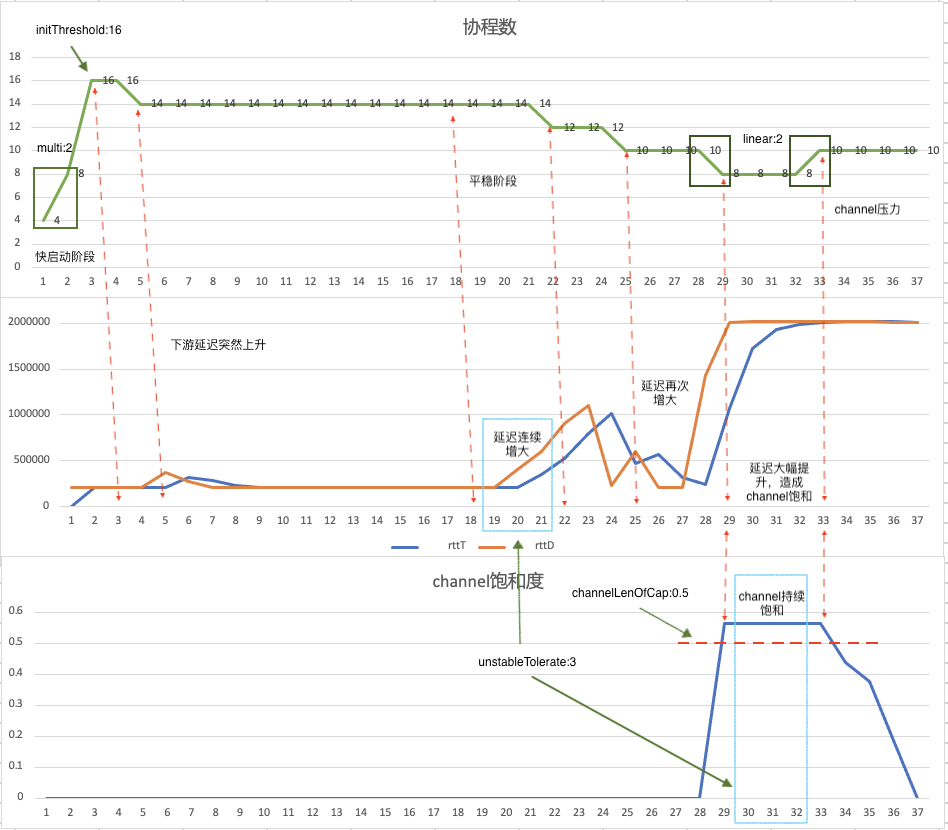
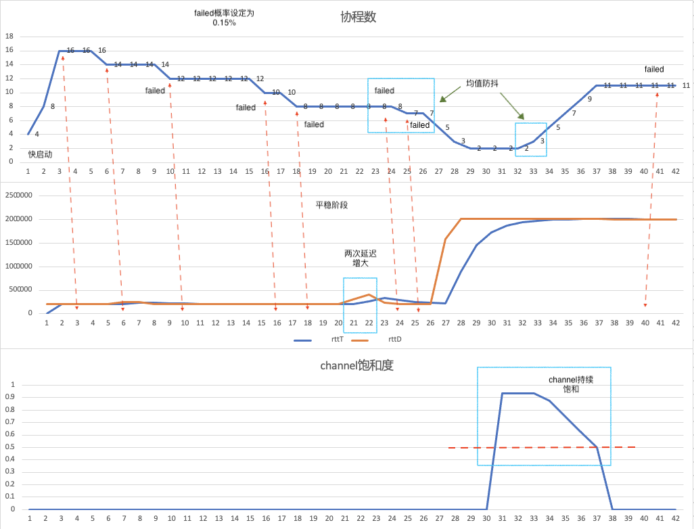

# 自适应sink流量控制

在日志被发送至下游服务时，并发度可以被控制。但起码有以下两点会对实际情况造成影响：下游服务器是否有压力，数据发送是否有压力。这两点是实时变化的，一个定值很难长期满足实际需求。

自适应sink流量控制功能可以：

- 根据下游数据响应的实际情况，自动调整下游数据发送并行数，要做到尽量发挥下游服务端的性能，且不影响其性能。

- 在上游数据收集被阻塞时，适当调整下游数据发送速度，缓解上游阻塞。

配置细节可参考[sink concurrency](../../reference/pipelines/sink/overview.md)。

## 关键词

- 响应速度：rtt，round trip time
- 响应是否成功：下游是否成功发送
- 上游是否阻塞：channel饱和度
- 并发值：sink启用的协程数
- 上个周期内平均响应速度：rtt last duration， rttD
- 整体平均响应速度：rtt total， rttT
- 指数增长（快启动）阈值：threshold

## 实现思路

核心是模仿tcp流量控制，并根据loggie自身做调整。

1. **快速启动阶段**

    - 协程数指数增长，到达阈值之后，快速启动结束，进行线性增长或减少，如果快启动阶段发生rtt增长或者收到失败返回，则快速启动直接结束。
    - 指数减少被取消，防止协程数大幅波动，减少开销。

2. **快速启动结束**

    - 快启动结束后开始统计数据，收集每次协程池调整的协程数。
    - 如果发生rtt增长或者收到失败返回则立刻减少协程数。
    - 如果channel饱和度达到一定值，并且当前rtt较为平稳，则增大协程数。
    - 一段时间后，获取每次协程池调整的协程数的平均值，进入平稳阶段。均值将作为后续调整协程数的一个限制，也是为了减少波动。

3. **平稳阶段**

    - 进入平稳阶段后，时间间隔增长。
    - 每次发生rtt增长或者收到失败返回，则累计一次缩小协程池的请求。
    - 如果channel饱和度达到一定值，并且当前rtt较为平稳，则累计一次扩大协程池的请求。
    - 相同的请求累计到达一定次数，则触发协程池调整，并清空相反方向的请求数。
    - 如果调整之后又一次收到相同的请求，会追加调整。
    - 平稳阶段协程数的调整会收到均值影响，若低于或高于均值太多，先仅调整均值，若再发生相同情况，才会调整协程池，并同时调整均值。

4. **其他细节**

    - 若channel饱和度达到100%，线性增长的幅度将会扩大。
    - rttT的计算公式为整体平均响应速度与上一周期的响应速度加权平均，即rttT.New =  a(rttD) + (1-a)rttT.Old。
    - 此功能默认不开启。开启需设置 concurrency.enable=true。

## 使用案例与解读

### 下游服务器

下游额外搭建了本地服务器，可以自由调整rtt值，用来模拟网络波动。

加入了随机的失败返回，概率可以设定。

阻塞情况用大幅增大rtt情况来模拟，由于rttT的不是固定的值，所以当rtt稳定后，不会对判断逻辑有影响。

### 配置

!!! config

    ```yaml
    concurrency:
      enable: true
      goroutine:
        initThreshold: 16
        maxGoroutine: 30
        unstableTolerate: 3
        channelLenOfCap: 0.4
      rtt:
        blockJudgeThreshold: 120%
        newRttWeigh: 0.5
      ratio:
        multi: 2
        linear: 2
        linearWhenBlocked: 4
      duration:
        unstable: 15
        stable: 30
    ```

### 案例一

模拟下游服务没有返回错误情况，仅调整rtt，测试算法对网络延迟的响应。



**解读**

- 0-3：快启动阶段，每次协程数翻倍
- 4：协程数到达16，快启动结束
- 5：rtt增长超过阈值，此时未进入平稳阶段，判断需减少协程数 ratio.linear=2
- 6-17：网络无波动，保持稳定
- 18: 收集足够数据，计算出平均协程数，进入平稳阶段
- 19-21：rtt连续增大3次，达到goroutine.unstableTolerate，将触发协程数减少
- 22：协程数减少
- 25：rtt再次增大，追加协程数再次减少
- 29：rtt再次增大，追加协程数减少，这是为了模拟下游发送过满，channel阻塞的情况
- 30-32：channel饱和度连续三次超过阈值，达到goroutine.unstableTolerate，将触发协程数增大
- 33：协程数增大
- 34-37：channel饱和度下降，不再有压力，同时网络稳定，协程数保持不变

### 案例二

在案例一的基础上，模拟下游有错误返回的情况，概率设定为0.15%。



**解读**

- 0-3：快启动
- 4：协程数到达阈值，快启动结束
- 6：rtt增大，此时未进入平稳阶段，判断协程数需减少
- 10：收到错误返回，减少协程数
- 16：收到错误返回，减少协程数
- 18：收到错误返回，减少协程数，且收集足够数据，计算平均协程数11，进入平稳阶段
- 21-22：rtt连续两次增大，但是goroutine.unstableTolerate为3，不会触发协程数调整
- 24：收到错误返回，达到goroutine.unstableTolerate，但是由于平均协程数为11，直接下调可能会造成较大抖动，于是仅仅下调平均数为9，下调量受ratio.linear控制
- 25：再次收到错误返回，追加协程数减少，此时平均数为9，下调下限为7，于是下降协程数到7
- 26-29：大幅提升rtt，协程数连续追加减少，这是为了模拟channel饱和的情况。当协程数过小时，会设置默认下限为2，保证有两个协程在运行，但是平均值此时被调整为1。
- 33：channel持续饱和，且rtt趋于稳定，此时上调协程数，由于均值为1，上调上限为3（上调上限也受ratio.linear控制），于是上调协程数至3，同时调整均值至3
- 34-37：channel持续饱和，持续追加上调协程数
- 38-42：channel不再饱和，rtt稳定，保持协程数不变，单个错误返回不会触发协程数调整。


!!! info 
    此功能在试验阶段，默认为关闭，欢迎交流讨论。  