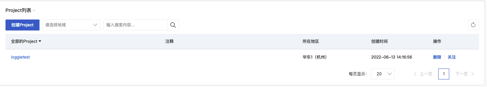
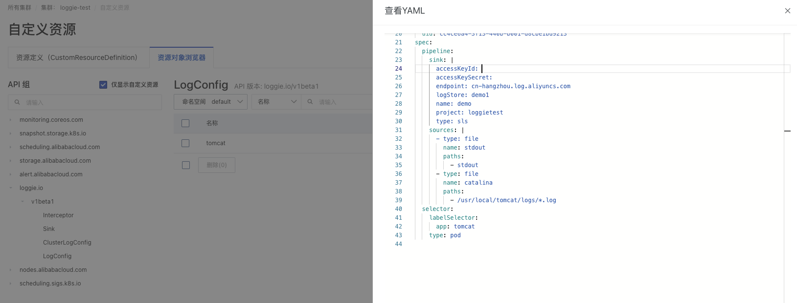
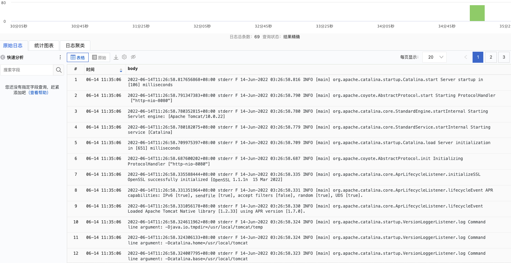

# 使用阿里云可观测统一存储SLS

不管你的服务部署在阿里云还是使用混合云的架构，Loggie同样支持采集日志数据至[阿里云可观测统一存储SLS](https://www.aliyun.com/product/sls)。
而你只需要使用`sls sink`即可。

> 阿里云官方文档中关于Loggie的使用请参考：[使用Loggie上传日志](https://help.aliyun.com/document_detail/434306.htm)


## 准备：创建SLS Project

为了使用阿里云可观测统一存储SLS，我们需要先创建一个对应的Project。
如下所示，在SLS页面中，点击`创建Project`，填入project名称和对应的地域，创建完之后同步创建相应的Logstore。


然后我们可以准备一下`sls sink`的配置，示例如下所示，具体可参考[sls sink 配置参数](../../reference/pipelines/sink/sls.md)：

!!! example "sls sink"

    ```yaml
        sink:
          type: sls
          name: demo
          endpoint: cn-hangzhou.log.aliyuncs.com
          accessKeyId: xxxx
          accessKeySecret: xxxx
          project: test
          logstore: test1
          topic: myservice
    ```

## 采集ECS上的日志

参考[主机部署](../../getting-started/install/node.md)的方式，我们可以修改pipeline.yml，加上sls sink的配置即可。

Pipeline配置参考示例如下：

!!! example "sls pipeline"

    ```yaml
    pipelines:
      - name: test
        sources:
          - type: file
            name: demo
            addonMeta: true
            paths:
              - /tmp/log/*.log
        sink:
          type: sls
          endpoint: cn-hangzhou.log.aliyuncs.com
          accessKeyId: ${accessKeyId}
          accessKeySecret: ${accessKeySecret}
          project: loggietest
          logstore: demo1
          topic: myservice
    ```

## 采集ACK Kubernetes集群的日志

和自建Kubernetes集群一样，Loggie同样可以部署在阿里云ACK的Kubernetes集群中。
我们可以根据ACK提供的kubeconfig文件，使用kubectl或者helm来部署。可参考[Kubernetes部署](../../getting-started/install/kubernetes.md)。

请注意：

- 如果希望采集未挂载emptyDir/hostPath的Pod日志，请确保values.yaml里系统配置中`discovery.kubernetes.rootFsCollectionEnabled`设置为true。
- 配置`discovery.kubernetes.containerRuntime`为匹配的Kubernetes集群的容器运行时，默认配置为containerd。

部署完之后，和常规的Kubernetes集群下的使用姿势类似，同样可以使用ClusterLogConfig/LogConfig/Interceptor/Sink CR的方式。

ACK提供了CRD的使用页面，我们可以直接在该页面中进行创建和修改。


采集某个服务的日志示例参考如下，只需使用`sls sink`即可。当然也可以使用单独创建一个sink CR存储`sls sink`配置，在LogConfig中通过sinkRef引用。

!!! example "logconfig"

    ```yaml
    apiVersion: loggie.io/v1beta1
    kind: LogConfig
    metadata:
      name: tomcat
      namespace: default
    spec:
      selector:
        labelSelector:
          app: tomcat
        type: pod
    
      pipeline:
        sources: |
          - type: file
            name: stdout
            paths:
              - stdout
          - type: file
            name: access
            ignoreOlder: 3d
            paths:
              - /usr/local/tomcat/logs/*.log
    
        sink: |
          type: sls
          endpoint: cn-hangzhou.log.aliyuncs.com
          accessKeyId: ${accessKeyId}
          accessKeySecret: ${accessKeySecret} 
          project: loggietest
          logstore: demo1
          topic: myservice
    ```

## 查看日志

我们可以在SLS具体的Project中查看采集的日志，如下图所示：


具体的元信息的添加和日志字段修改，可参考[日志切分处理](../best-practice/log-process.md)以及[日志增加元信息](../best-practice/log-enrich.md)。

