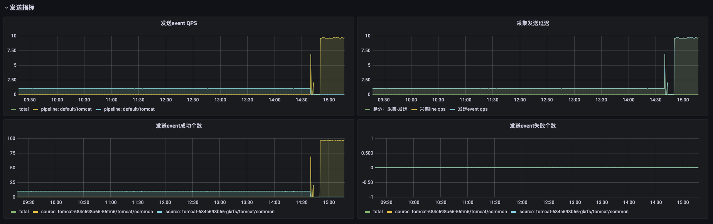

# Loggie的监控与报警

Loggie的monitor eventbus被设计为发布和订阅模式，各个组件发送metrics到指定的topic中，由独立的listener来消费处理。  

比如`file source`会将采集日志的一些指标数据，发送至`filesource topic`，由`filesource listener`来消费，`filesource listener`会将数据聚合计算之后，打印至日志，暴露出Prometheus指标。

组件和topic以及listener之间是松耦合关系，比如`file source`还会定时将全量匹配的日志文件指标发送至`filewatcher topic`，`filewatcher listener`会处理和暴露指标。  

## Monitor配置
monitor eventbus配置在全局的系统配置中，示例如下：

!!! config

    ```yaml
    loggie:
      monitor:
        logger:
          period: 30s
          enabled: true
        listeners:
          filesource: ~
          filewatcher: ~
          reload: ~
          queue: ~
          sink: ~
      http:
        enabled: true
        port: 9196
    ```

其中`logger`控制所有的metrics指标的日志打印，会在`period`时间间隔将配置listeners产生的metrics聚合打印在Loggie日志中，便于回溯和排查问题。  

`listeners`则用于配置相关的listener是否开启。  

Prometheus格式metrics默认通过`http.port`端口暴露在`/metrics`。可以通过`curl <podIp>:9196/metrics`来查看当前的metrics指标。  

## 日志采集核心指标
目前有以下的listener：

- **filesource**: 当前日志采集的指标数据，比如当前有哪些文件在采集中，采集状态如何
- **filewatcher**: 定时的全量遍历（默认5min)配置path匹配的所有文件，监控全局采集状态，判断是否有未及时采集的文件等
- **reload**: reload次数
- **queue**: 队列状态
- **sink**: 发送的指标，比如发生成功或者失败的个数等

## 部署Prometheus和Grafana
可以使用环境已有的Prometheus或者Grafana，如果需要新部署，可参考：https://github.com/prometheus-community/helm-charts/tree/main/charts/kube-prometheus-stack。

使用Helm部署:
```bash
helm repo add prometheus-community https://prometheus-community.github.io/helm-charts
helm repo update
helm install prometheus prometheus-community/kube-prometheus-stack -nprometheus --create-namespace
```

!!! note
    由于众所周知的原因，你的环境里可能无法下载其中的某些`k8s.gcr.io`镜像，可以考虑下载chart包替换后再重新部署。  

确认Pod正常running后，可以根据实际环境访问grafana。通过代理访问grafana的方式可参考：  

```bash
kubectl -nprometheus port-forward --address 0.0.0.0 service/prometheus-grafana 8181:80
```

Grafana用户名和密码可在prometheus-grafana sercret中，通过`base64 -d`来查看。

## 增加Loggie Prometheus监控

在部署了Loggie的Kubernetes集群中，需要创建如下的ServiceMonitor来让Prometheus采集Loggie Agent指标。  

```yaml
apiVersion: monitoring.coreos.com/v1
kind: ServiceMonitor
metadata:
  labels:
    app: loggie
    release: prometheus
  name: loggie-agent
  namespace: prometheus
spec:
  namespaceSelector:
    matchNames:
    - loggie
  endpoints:
  - port: monitor
  selector:
    matchLabels:
      app: loggie
      instance: loggie
```

同时，我们需要在Grafana中添加install工程中的[json](https://github.com/loggie-io/installation/tree/main/prometheus/grafana-dashboard)来展示Loggie的监控控制台。  

!!! note
    Kubernetes版本和Grafana版本不同，可能导致图表展示不兼容，需要根据情况进行修改。  

导入的Grafana图表目前包含监控大盘和节点Agent的监控图表，如下图所示：





