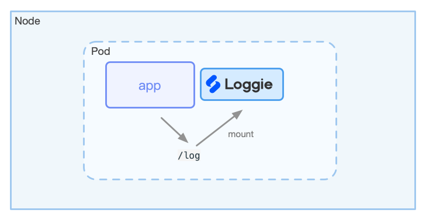

# Kubernetes下的日志采集

!!! cite
    相比传统的主机日志采集，在Kubernetes集群中，采集容器日志有一些差异，使用方式上也有所区别。
    这里我们罗列了一些常规的部署和使用方式以供参考。

## 1. 从主机到容器
在传统的使用虚拟机/云主机/物理机的时代，业务进程部署在固定的节点上，业务日志直接输出到宿主机上，运维只需要手动或者使用自动化工具把日志采集Agent部署在节点上，加一下Agent的配置，就可以开始采集日志了。  

而在Kubernetes环境中，情况就没这么简单了：

- **动态迁移**：在Kubernetes集群中经常存在Pod主动或者被动的迁移，频繁的销毁、创建，我们无法和传统的方式一样人为的给每个服务下发日志采集配置。
- **日志存储方式多样性**：容器的日志存储方式有很多不同的类型，例如stdout、hostPath、emptyDir、pv等。
- **Kubernetes元信息**：由于日志数据采集后会被集中存储，所以查询日志时，需要根据namespace、pod、container、node，甚至包括容器的环境变量、label等维度来检索、过滤，此时要求Agent感知并默认在日志里注入这些元信息。  

以上都是有别于传统日志采集配置方式的需求和痛点，究其原因，还是因为传统的方式脱离了Kubernetes，无法感知Kubernetes，无法和Kubernetes集成。  

## 2. 在Kubernetes下的日志形态

为了采集容器日志，我们先来看一下市面上一般都有哪些解决方案。  

### 2.1 采集的日志类型
首先，需要提及的是，在云原生的12要素里，推荐业务容器将日志输出到stdout中，而不是采用打印日志文件的方式。当然，实际情况是，我们很难这么做，原因大概有：  

- 需要业务方修改日志配置，比较难以推广
- 有些复杂的业务对日志文件有分类，比如审计日志、访问日志等，一般会输出为独立的日志文件，日志采集需根据不同的文件分类进行不同的处理

所以正常情况下，我们需要同时采集：

- **标准输出stdout**
- **日志文件**

### 2.2 Agent部署方式
采集容器日志，Agent有两种部署方式：

1. **DaemonSet**：每个节点部署一个Agent
2. **Sidecar**：每个Pod增加一个Sidecar容器，运行日志Agent

两种部署方式的优劣都显而易见：

- 资源占用：DaemonSet每个节点上一个，而Sidecar每个Pod里一个，容器化形态下，往往一个Node上可能会跑很多的Pod，此时DaemonSet的方式远小于Sidecar，而且节点上Pod个数越多越明显
- 侵入性：Sidecar的方式，Agent需要注入到业务Pod中，不管是否有平台封装这一过程，还是采用Kubernetes webhook的方式默认注入，仍然改变了原本的部署方式
- 稳定性：日志采集在大部分的情况下，需要保障的是稳定性，最重要的是不能影响业务，如果采用Sidecar的方式，在Agent发生异常或者oom等情况，很容易对业务容器造成影响。另外，Agent比较多的时候，在连接数等方面会对下游服务比如Kafka造成一定的隐患。  
- 隔离性：DaemonSet情况下，节点所有的日志都共用同一个Agent，而Sidecar方式，只会采集同一个Pod内的业务日志，此时Sidecar的隔离性理论上会好一些
- 性能：Sidecar由于只会采集该Pod里的日志，压力相对较小，极端情况下，达到Agent的性能瓶颈比DaemonSet方式概率也会小很多

!!! tip 
    正常情况下，优先使用DaemonSet的方式采集日志，如果单个Pod日志量特别大，超过一般Agent发送吞吐量，可以单独对该Pod使用Sidecar的方式采集日志。  

### 2.3 采集方式

#### DaemonSet + Stdout

如果使用容器运行时的是docker，正常情况下我们可以在节点的docker路径中找到容器的stdout的日志，默认为`/var/lib/docker/containers/{containerId}/{containerId}-json.log`。  

在Kubernetes 1.14版本之前，kubelet会在`/var/log/pods/<podUID>/<containerName>/<num>.log`建立一个软链接到stdout文件中。  

类似如下所示：  
```bash
root@master0:/var/log/pods# tree .
|-- 6687e53201c01e3fad31e7d72fbb92a6
|   `-- kube-apiserver
|       |-- 865.log -> /var/lib/docker/containers/3a35ae0a1d0b26455fbd9b267cd9d6ac3fbd3f0b12ee03b4b22b80dc5a1cde03/3a35ae0a1d0b26455fbd9b267cd9d6ac3fbd3f0b12ee03b4b22b80dc5a1cde03-json.log
|       `-- 866.log -> /var/lib/docker/containers/15a6924f14fcbf15dd37d1c185c5b95154fa2c5f3de9513204b1066bbe474662/15a6924f14fcbf15dd37d1c185c5b95154fa2c5f3de9513204b1066bbe474662-json.log
|-- a1083c6d-3b12-11ea-9af1-fa163e28f309
|   `-- kube-proxy
|       |-- 3.log -> /var/lib/docker/containers/4b63b5a90a8f9ca6b6f20b49b5ab2564f92df21a5590f46de2a46b031e55c80e/4b63b5a90a8f9ca6b6f20b49b5ab2564f92df21a5590f46de2a46b031e55c80e-json.log
|       `-- 4.log -> /var/lib/docker/containers/fc7c315d33935887ca3479a38cfca4cca66fad782b8a120c548ad0b9f0ff7207/fc7c315d33935887ca3479a38cfca4cca66fad782b8a120c548ad0b9f0ff7207-json.log
```

在Kubernetes 1.14版本之后，改成了`/var/log/pods/<namespace>_<pod_name>_<pod_id>/<container_name>/<num>.log`的形式。  

```bash
root@master-0:/var/log/pods# tree .
|-- kube-system_kube-apiserver-kind-control-plane_bd1c21fe1f0ef615e0b5e41299f1be61
|   `-- kube-apiserver
|       `-- 0.log
|-- kube-system_kube-proxy-gcrfq_f07260b8-6055-4c19-9491-4a825579528f
|   `-- kube-proxy
|       `-- 0.log
`-- loggie_loggie-csd4g_f1cc32e9-1002-4e64-bd58-fc6094394e06
    `-- loggie
        `-- 0.log
```

所以，对于Agent采集标准输出日志来说，也就是采集节点上的这些日志文件。  

一种简单粗暴的采集方式是，使用DaemonSet部署日志Agent，挂载`/var/log/pods`目录，Agent的配置文件使用类似`/var/log/pod/*/*.log`去通配日志文件，采集节点上所有的容器标准输出。  


但是这样的局限在于：

- 无法注入更多元信息比如一些pod的label/env等，特别是在k8s1.14版本之前，甚至无法在采集的path里获取到namespace/pod等信息
- 很难针对单个服务配置特殊的配置，比如某个文件需要使用特殊的多行日志采集，需要配置适合服务自身的日志格式切分等
- 会采集很多不必要的容器日志，造成采集、传输、存储压力

当然现在的一些日志Agent比如Filebeat/Fluentd都针对性的做了支持，比如可以将namespace/pod等信息注入日志中，但仍然没有解决大部分的问题。  

所以，这种方式只适合简单的业务场景，后续也难以满足其他更多的日志需求。  

#### DaemonSet + 日志文件

如果Pod里不仅仅是输出stdout，还包括日志文件，就需要考虑到挂载日志文件到节点上，同时采用DaemonSet部署的Agent也需要挂载相同的目录，否则采用容器化部署的Agent无法查看到相应的文件，更无法采集。  

业务Pod挂载日志路径的方式有以下几种：

**(1) emtpyDir**

emtpyDir的生命周期跟随Pod，Pod销毁后其中存储的日志也会消失。  

- 优点：使用简单，不同Pod都使用自己的emtpyDir，有一定的隔离性。  
- 缺点：日志如果采集不及时，在Pod消耗后，存在丢失的可能性。  

使用emptyDir挂载的日志文件，一般在节点的路径如下：
```
/var/lib/kubelet/pods/${pod.UID}/volumes/kubernetes.io~empty-dir/${volumeName}
```

**(2) hostPath**

生命周期和Pod无关，Pod迁移或者销毁，日志文件还保留在现有磁盘上。    

- 优点：生命周期和Pod无关，即使Pod销毁，日志文件依然在节点磁盘上，假设Agent没有采集日志，仍然可以找到日志文件
- 缺点：默认无隔离性，需要控制挂载的日志路径；另外，Pod迁移节点后，残留的日志文件长期积累容易占据磁盘，同时日志占据的磁盘无法控制使用的配额

为了解决隔离性，避免多个Pod打印日志到相同的路径和文件中，我们需要使用 subPathExpr 字段从 Downward API 环境变量构造 subPath 目录名。 
该 VolumeSubpathEnvExpansion 功能从 Kubernetes1.15 开始默认开启，在1.17 GA。可参考 [feature-gates](https://kubernetes.io/docs/reference/command-line-tools-reference/feature-gates/) 和 [using-subpath-expanded-environment](https://kubernetes.io/docs/concepts/storage/volumes/#using-subpath-expanded-environment)。

使用subPathExpr的示例如下所示：
```yaml
apiVersion: apps/v1
kind: Deployment
metadata:
  labels:
    app: nginx
  name: nginx
  namespace: default
spec:
  selector:
    matchLabels:
      app: nginx
  template:
    metadata:
      labels:
        app: nginx
    spec:
      containers:
      - env:
        - name: POD_NAME
          valueFrom:
            fieldRef:
              apiVersion: v1
              fieldPath: metadata.name
        - name: NAMESPACE
          valueFrom:
            fieldRef:
              apiVersion: v1
              fieldPath: metadata.namespace
        image: nginx
        name: nginx
        resources: {}
        volumeMounts:
        - mountPath: /data/log
          name: datalog
          subPathExpr: $(NAMESPACE)/$(POD_NAME)
      volumes:
      - hostPath:
          path: /data/log
          type: ""
        name: datalog

```

在创建完之后，我们可以在所在节点的`/data/log`下发现类似的目录结构：
```
.
`-- default
    |-- nginx-888dc6778-krfqr
    `-- nginx-888dc6778-sw8vd
```
每个Pod的存放的日志文件即在节点的`/data/log/$(NAMESPACE)/$(POD_NAME)`路径下。

**(3) Pv**  
Pv的访问模式包括：

- ReadWriteOnce（RWO）：读写权限，并且只能被单个Node挂载。
- ReadOnlyMany（ROX）：只读权限，允许被多个Node挂载。
- ReadWriteMany（RWX）：读写权限，允许被多个Node挂载。

对于大部分的业务来说，都是Deployment无状态部署，需要挂载同一个Pv共享；对于一些中间件等有状态服务，一般会使用StatefulSet部署，每个Pod会使用独立的Pv。

- 优点：存储日志不容易丢失；
- 缺点：有一定的使用和运维复杂度；多个Pod共享同一个Pv时存在隔离性问题；很多的日志Agent对采集云盘上的日志文件支持不够成熟，可能存在一些隐患；

虽然同样可以在Node上找到使用Pv挂载的对应日志文件，但是Pv根据不同的底层实现，在Node上的路径会有一定的区别。  

目前市面上大部分日志Agent均对这些挂载方式没有感知，所以你能做的和上面使用stdout的方式类似，也就是简单粗暴的让Agent将路径都挂载，使用通配的方式采集所有的日志，使用上的局限和stdout的方式同样一致。  


另外，鉴于一些Agent对采集docker stdout有一定的支持，所以还存在一些使用上变种，比如利用webhook注入一个sidecar，读取Pod里的日志文件，转换成sidecar的stdout，然后采集sidecar的stdout日志，这里不再详述。  

**（4）不挂载**

很多情况下，用户都疏于挂载日志路径volume，或者对接一个已经存在的系统，往往业务方不愿意更改，这个时候能采集容器里的日志文件吗？

Loggie尝试解决了这个问题，可以通过配置开启，不过这种方式仍然需要更多长期生产实践的检验。欢迎试用，具体开关请参考下一节。


#### Sidecar + Stdout/日志文件
如果需要采用sidecar的方式，需要将日志Agent同时挂载相同的日志路径，Agent的配置文件也一般使用ConfigMap挂载出来。

使用Sidecar的部署方式和DaemonSet的方式优劣对比请参考上文。  



**总结**：  
大部分主流的开源Agent，只对容器Stdout有部分支持，比如支持采集的时候统一加上一些K8s相关元信息，但不支持单独针对某些Pod进行配置，而且均没有对容器中的日志文件采集有很好的支持。  
这样导致在实际复杂的各类业务场景中，没办法满足需求。  

## Loggie如何解决这些问题？
相信以上列出的问题大家都遇到或者思考过，那Loggie是如何解决这些问题的呢？  
请看下一节如何 [使用Loggie采集容器日志？](collect-container-logs.md)
