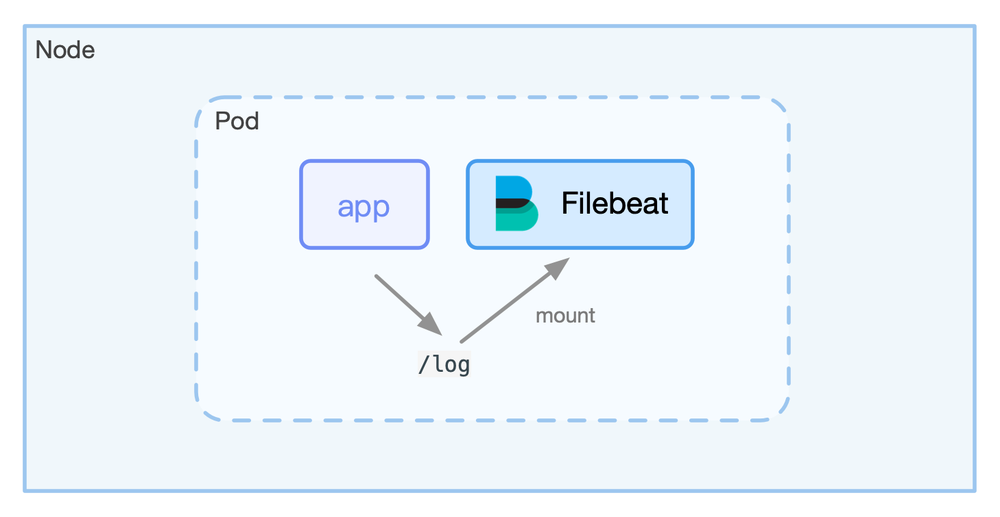

# Loggie Sidecar方式采集日志

> 虽然默认不推荐使用Sidecar方式采集容器日志，但是在某些受限场景下只能选择使用Sidecar的方式采集容器日志，这里我们给出一个参考的示例。  

## 总体思路

如下图所示：


Loggie和业务container部署在同一个Pod里，同时需要挂载相同的日志文件volume，另外Loggie的配置可通过configMap的方式挂载到容器中，Loggie根据提供的configMap配置文件，采集容器的日志，并发送到后端。  


## 注入Loggie sidecar

```yaml
apiVersion: apps/v1
kind: Deployment
metadata:
  labels:
    app: tomcat
  name: tomcat
  namespace: default
spec:
  replicas: 1
  selector:
    matchLabels:
      app: tomcat
  template:
    metadata:
      labels:
        app: tomcat
    spec:
      containers:
      - name: tomcat
        image: tomcat
        volumeMounts:
        - mountPath: /usr/local/tomcat/logs
          name: log

      - name: loggie
        args:
        - -config.system=/opt/loggie/loggie.yml
        - -config.pipeline=/opt/loggie/pipeline.yml
        image: hub.c.163.com/loggie-io/loggie:lastest
        volumeMounts:
        # loggie和业务container挂载相同的log volume
        - mountPath: /usr/local/tomcat/logs
          name: log
        # 挂载日志配置configMap
        - mountPath: /opt/loggie
          name: loggie-config
        # 挂载loggie自身持久化的数据
        - mountPath: /data
          name: registry

      volumes:
      - emptyDir: {}
        name: log
      - emptyDir: {}
        name: registry
      - name: loggie-config
        configMap:
          name: tomcat-loggie-config

---
apiVersion: v1
kind: ConfigMap
metadata:
  name: tomcat-loggie-config
  namespace: default
data:
  loggie.yml: |
    loggie:
      reload:
        enabled: true
        period: 10s
      monitor:
        logger:
          period: 30s
          enabled: true
        listeners:
          filesource: ~
          filewatcher: ~
          reload: ~
          sink: ~
      http:
        enabled: true
        port: 9196
  pipeline.yml: |
    pipelines:
    - name: "tomcat"
      sources:
        - type: "file"
          name: "tomcatlog"
          paths:
            - "/usr/local/tomcat/logs/*.log"
          fields:
            namespace: default
            deployment: tomcat
          fieldsFromEnv:
            podname: HOSTNAME
      sink:
        type: "dev"
        printEvents: true
        codec:
          pretty: true
        
```

可以参考以上的部署方式通过loggie sidecar采集容器日志。  
需要注意的是：

- 目前不建议在配置文件中enable kubernetes discovery，由于打开后会请求Kubernetes，在Pods比较多的时候，会对Kubernetes造成一定压力，所以无法使用LogConfig CRD，需要使用configMap挂载配置文件。  
- 由于不使用Kubernetes discovery，这里的fields并不会被自动加上Pod的元信息，需要使用fieldsFromEnv的方式从Pod的环境变量里获取。
  
!!! tips
    - namespace等固定信息可以配置到fields里，也可以通过使用downward API的方式引用到env里
    - fieldsFromEnv获取到的Env环境变量不仅仅局限在Pod yaml里配置的env字段，Loggie容器里任意的环境变量均可，我们可以在容器里执行`env`命令查看。  
  
- 修改configMap中的参数，需要经过一段时间后才会被刷新到Pod里，如果希望立即生效，需要重建Pod，请注意是否影响业务

!!! info 
    Loggie后续会支持自动Sidecar注入和通过LogConfig自动生成ConfigMap挂载的方式，从而达到和使用DaemonSet一致的体验。  
