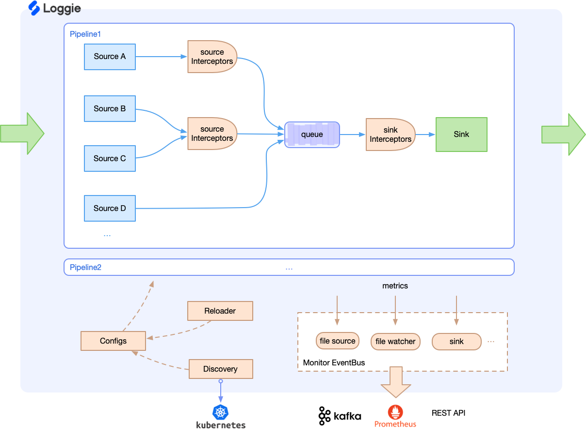

# 设计架构

## 内部设计
Loggie详细的设计如下图所示：

**数据链路**:

- 支持多pipeline，每个pipeline相对独立
- 每个pipeline有多个source、一个queue和一个sink
- interceptor实际上分为source interceptor和sink interceptor两种不同类型，source类的interceptor可配置被某个source独占

**控制链路**:

- 目前有Kubernetes为配置中心，可以通过CRD的方式下发日志配置，当然你也可以手动配置文件
- 打开Reloader可以动态检测配置变动并重载
- 组件可发送对应topic的metrics，由listener来消费处理，并进一步暴露或者发送指标

## 使用形态
本质上Loggie是一个数据传输流式设计，所以我们可以灵活的使用Loggie的Pipeline。从使用形态上可分为：  

- **Agent** 形态：每个节点一个或者每个Pod一个，用于采集配置的日志或者其他数据
- **Aggregator** 形态：用于中转和转发，可独立部署成集群

除了日志采集，很多涉及到数据传输、转换的场景，都可以考虑使用Loggie，即使Loggie没有你想要的组件，你也可以快速开发一个source、sink或interceptor，同时复用Loggie的很多能力，避免重复的开发工作，比如：

- 在Kubernetes集群中可方便、直接的使用CRD下发配置，并且支持自动reload、支持指定Loggie集群，无需考虑部署、配置更新等问题
- 依赖Loggie提供传输过程的稳定性和可靠性，保证at-least-once和重试机制，避免数据丢失，以及数据量过多或过大造成的隐患
- 使用Loggie提供的一系列监控指标，比如队列长度、传输延迟、发送QPS等，可快速接入Prometheus，同时还可使用一些系统内置的快速排障的接口与能力
- 使用可插拔的Interceptor可用于自定义的数据处理、格式转换等，避免过多的定制化代码开发
...

## 应用场景

- 日志采集：采集容器日志、采集节点日志
- 数据中转：日志中转机聚合、转发、分流
- 数据处理：进行数据的切分、转换、处理
- 日志报警：进行异常日志的检测与报警  
...